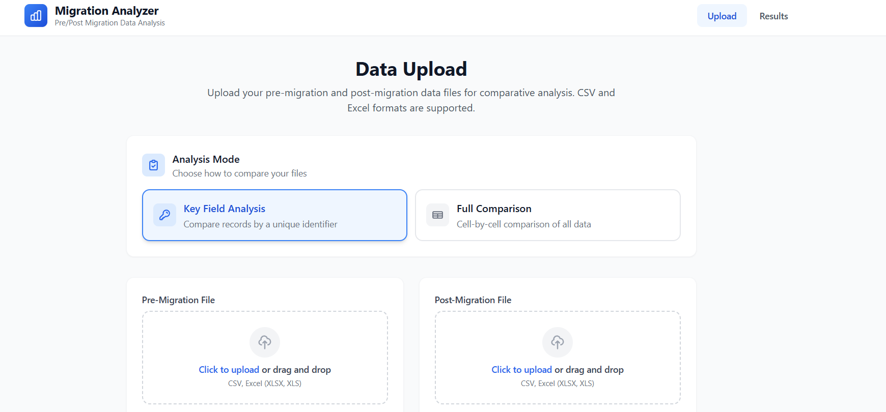
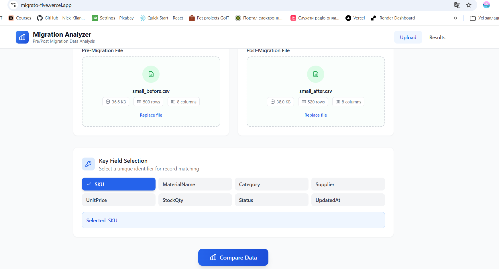
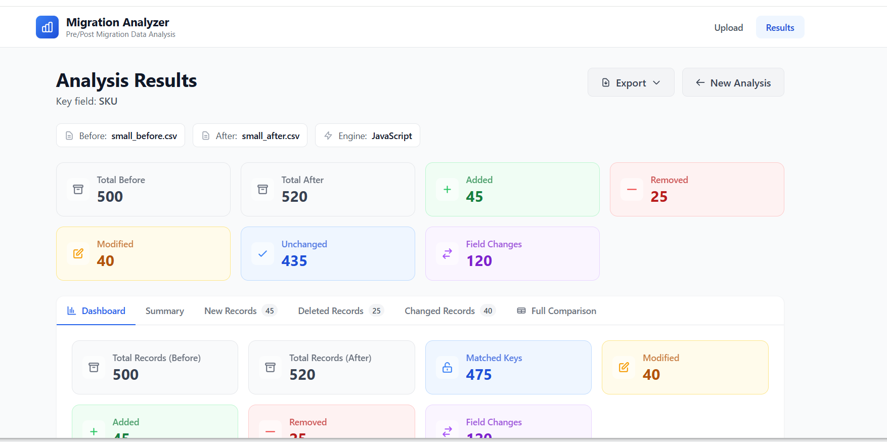
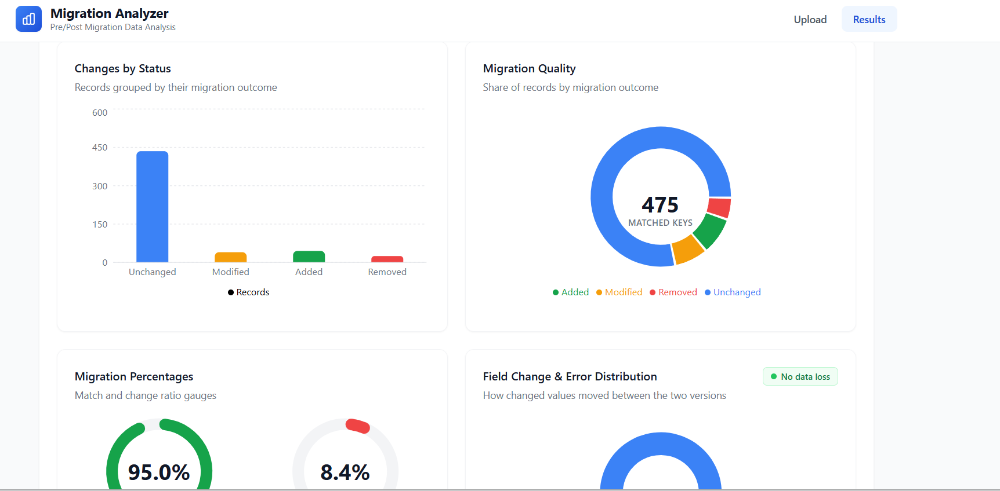
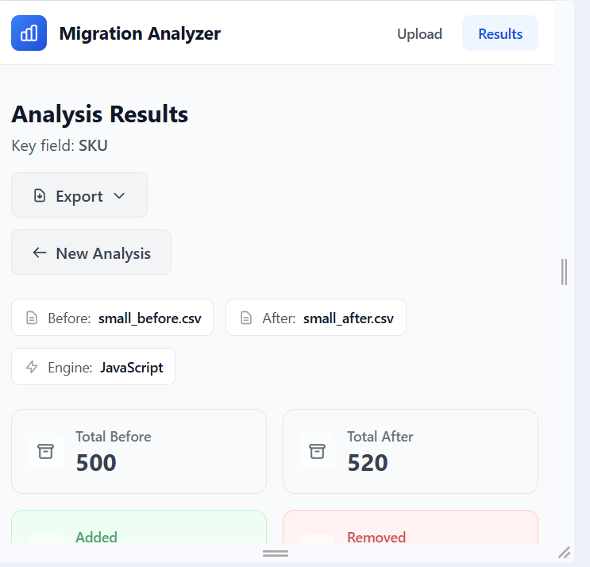

# Migration-Data-Analyzer
Migration data analyzer

# 📊 Migratio

> Data migration analyzer developed with React, TypeScript, Node.js, Express and Vite.  
> Web application for comparing datasets before and after migration.


[](https://migrato-five.vercel.app)

---

## 🌐 Live Demo

👉 https://migrato-five.vercel.app

---

## 📖 About

**Migratio** is a lightweight web application designed to validate data migration.  
It allows users to upload two datasets (*Pre-Migration* and *Post-Migration*) and automatically compare them to detect inconsistencies.

The tool simplifies migration testing by providing clear reports and visualizations without the need for databases or manual checks.

---

## ✨ Features

- ✅ Upload Excel/CSV files (*before* and *after* migration)  
- ✅ Two analysis modes:
  - **Key Field Analysis** — compare records by unique identifier  
  - **Full Comparison** — cell-by-cell comparison of all data  
- ✅ Instant conversion of Excel into lightweight JSON for fast processing  
- ✅ Visualization of differences in a clean UI  
- ✅ Export results to Excel/PDF  
- ✅ Responsive interface for desktop and mobile  
- ✅ Works entirely in-browser (DuckDB WASM, no external DB required)  
- ✅ Strong type safety with **TypeScript** (≈75% codebase)  

---

## 📷 Screenshots

### Upload & Compare



### Comparison Result



### Mobile Version


---

## 🏗 Architecture

```text
┌─────────────────────┐
│ React + Vite + TS   │
│ Frontend            │
└──────────┬──────────┘
           │
           ▼
┌─────────────────────┐
│ Node.js + Express   │
│ Backend API         │
└──────────┬──────────┘
           │
           ▼
   DuckDB WASM (in-browser)
